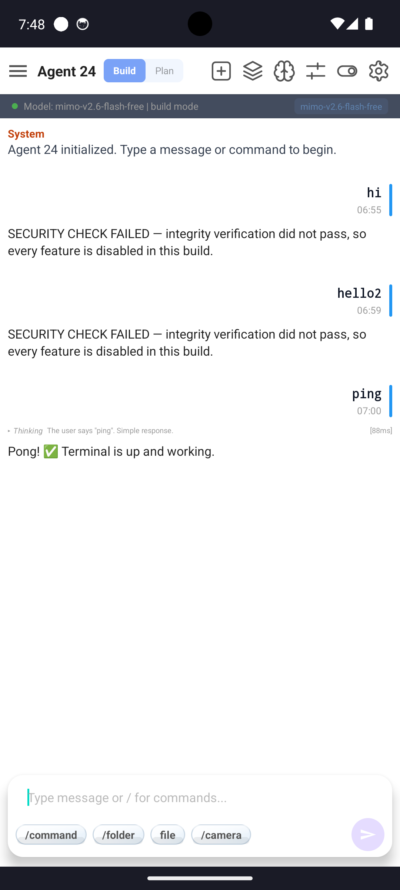
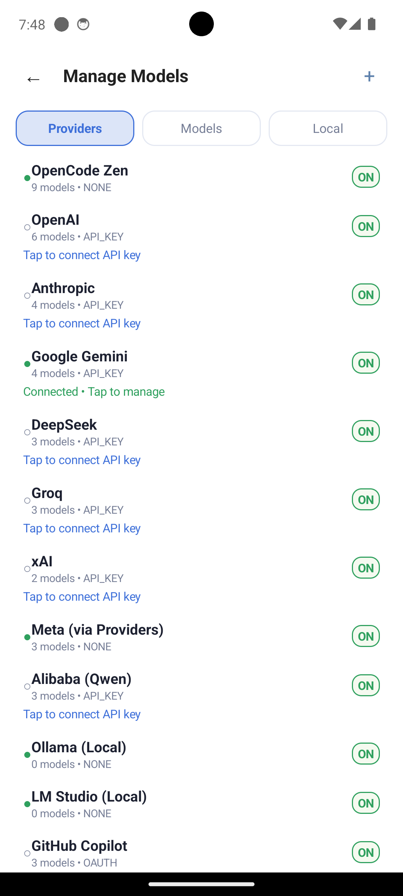
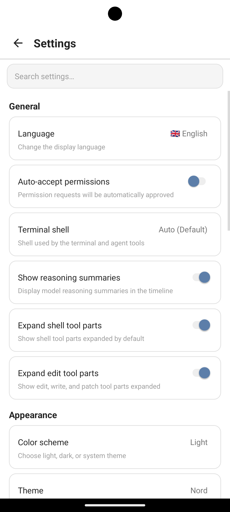

<div align="center">
  <h1>🤖 Agent 24</h1>

  <p><b>An AI coding & technical assistant for Android.</b></p>

  <p>
    Chat with leading AI models, let it plan and execute multi-step work, edit files,<br>
    run shell commands, browse the web, drive the terminal, and control parts of the<br>
    device itself — all from one app that keeps you in charge through an explicit<br>
    permission system.
  </p>

  

  <p>
    <a href="https://foysalahammad.github.io/agent24"></a>
    <a href="https://foysalahammad.github.io/agent24/#tools"></a>
    <a href="https://github.com/FoysalAhammad/agent24/releases"></a>
    <a href="https://foysalahammad.github.io/agent24"></a>
    <a href="LICENSE"></a>
    <a href="https://foysalahammad.github.io/agent24/#privacy"></a>
  </p>

  <p>
    <a href="https://foysalahammad.github.io/agent24">Docs</a> ·
    <a href="https://foysalahammad.github.io/agent24/#privacy">Privacy Policy</a> ·
    <a href="#-what-you-get">Features</a> ·
    <a href="#-agents">Agents</a> ·
    <a href="#-tools">Tools</a> ·
    <a href="#-providers">Providers</a> ·
    <a href="#-getting-started">Getting started</a>
  </p>
</div>

---

## 🧭 Introduction

Most Android AI assistants stop at chat replies. Agent 24 works the other way around: you state the goal, it works out a plan, picks the right tools, runs them, checks the result, and only then reports back. Every step that could touch your files, your shell, or your device goes through a permission gate, so nothing surprising happens behind your back.

It ships as a complete workspace:

<table>
  <tr>
    <td width="34%" align="center" valign="top">
      
    </td>
    <td width="33%" align="center" valign="top">
      
    </td>
    <td width="33%" align="center" valign="top">
      
    </td>
  </tr>
</table>

- **AI Chat** — the main agent loop with streaming replies, tool cards, and reasoning display
- **Terminal** — a real Termux-based shell with the package manager, storage already mounted, and a welcome banner that links to this repository
- **Code Editor** — edit files without leaving the app
- **File Explorer** — browse the device and project tree
- **Live Preview** — the `serve` tool renders localhost sites in-app with a desktop / mobile viewport toggle and a one-tap "Open in Browser"

---

## ✨ What you get

| Feature | What it does |
|---|---|
| 🧠 **Truly agentic** | Plans, executes, verifies, and iterates — not just replies. |
| 🔧 **31 built-in tools** | Shell, files, search, patches, web, git, documents, vision, device control. |
| 🔐 **Permission-first** | Every sensitive action is `allow` / `ask` / `deny`, with a Deny · Always · Allow popup. |
| 📱 **Device control** | Read sensors, flash the torch, vibrate, change brightness, toggle wifi/location and more. |
| 🌍 **Model-agnostic** | Works with 12 pre-configured providers and dozens of models. |
| 📴 **Everything stays local** | Sessions, history, memory and settings live on your device. |
| 🌐 **Speaks your language** | Understands you in Bangla, Hindi, and 97 other languages — with an option to force the reply language. |
| 🔌 **MCP-ready** | External MCP servers plug straight into the tool layer. |
| 🖥 **Live preview** | Localhost sites render in-app with desktop/mobile toggle and browser hand-off. |
| 🔄 **Smart updates** | The app checks GitHub Releases and offers a verified, resumable update. |

---

## 🤖 Agents

A layered agent system — pick the right one for the job.

| Agent | Type | Purpose |
|---|---|---|
| **Build** | Primary | Default agent with full tool access for real work. |
| **Plan** | Primary | Read-only analysis; asks before any edit or command. |
| **General** | Subagent | Autonomous multi-step tasks delegated by the main agent. |
| **Explore** | Subagent | Fast, read-only codebase search and summarisation. |
| **Scout** | Subagent | External documentation and dependency research. |
| **Compaction** | System | Summarises context automatically when it grows too long. |
| **Title / Summary** | System | Generates session titles and conversation summaries. |

---

## 🧰 Tools

The model can call these during any conversation:

| Group | Tools |
|---|---|
| **Core** | `bash` `shell` `read` `write` `edit` `diff` `apply_patch` |
| **Search** | `grep` `glob` `list` |
| **Web** | `webfetch` `websearch` `serve` |
| **Documents & media** | `pdf` `pdf_edit` `pdf_maker` `docx_maker` `cv_maker` `archive` `image_analyze` `image_describe` |
| **Device & system** | `screenshot` `ui_dump` `sensor` |
| **Productivity** | `git` `memory` `schedule` `todowrite` `todoread` `task` `skill` `question` |

You can also drop in your own tools as plain markdown files in the config folder.

### 📱 Device control

The `sensor` tool talks to the hardware directly:

- list every sensor the phone exposes, take a live reading, or sample one over a few seconds with min/max/avg
- flashlight, vibrate, brightness, volume, rotation lock
- wifi, bluetooth, location, airplane mode, do-not-disturb, screen on/off

System-level changes ask for permission first and run through `su` when the device is rooted — on a rooted phone the agent can grant its own missing permission (like camera for the torch) with your approval.

### ⌨️ Slash commands

<p>
  <code>/new</code> <code>/clear</code> <code>/sessions</code> <code>/model</code> <code>/connect</code> <code>/build</code> <code>/plan</code> <code>/init</code>
</p>
<p>
  <code>/diff</code> <code>/cwd</code> <code>/undo</code> <code>/redo</code> <code>/fork</code> <code>/review</code> <code>/compact</code> <code>/share</code> <code>/skills</code>
</p>
<p>
  <code>/agents</code> <code>/theme</code> <code>/export</code> <code>/import</code> <code>/help</code>
</p>

---

## 🔐 Permissions

Every tool sits behind a permission key — `read`, `edit`, `bash`, `task`, `webfetch`, `sensor`, and so on — with one of three values:

- **allow** — runs right away
- **ask** — pops a confirmation (Deny · Always · Allow) and waits
- **deny** — blocked completely

On first launch the app asks for everything it needs up front: storage, camera, battery exemption, and all-files access. "Always" grants permission for the whole session, so you are not clicking the same thing twice.

API credentials stay on your device, never show up in chat, and are never written into exported sessions.

---

## 🔒 Security & Privacy

Agent 24 is designed so that **your data never leaves your device except to the AI provider you explicitly configured**. There is no Agent 24 server.

### What is stored locally (on-device only)

| Data | Where | Purpose |
|---|---|---|
| Chat history | App-private SQLite database | Conversation context |
| API keys | Android Keystore + encrypted prefs | Provider authentication |
| Sessions, settings, todos | App-private storage | App functionality |
| Crash logs (optional) | On-device, opt-in | Bug fixing only |

### What is sent over the network

| Data | Destination | Purpose |
|---|---|---|
| Your prompts & conversation context | **Only** the AI provider you selected (OpenAI, Anthropic, Google, …) | Generating model replies |
| Sensor readings, screenshots, UI dumps | The same AI provider — **only** as tool output for a task you requested in that session | Completing that task; never linked to device identifiers |
| Nothing else | — | No telemetry, no analytics by default, no data sale |

### Persistent device identifiers

The app does **not** collect or use IMEI, IMSI, SIM serial numbers, the Android Advertising ID (AAID) or the App Set ID, and does **not** link any persistent device identifier to personal or sensitive user data or to resettable device identifiers.

### Third-party code & advertising

Bundled components (PDF processing, on-device OCR, the terminal runtime) run entirely on your device; no embedded SDK sells personal or sensitive user data. When ads are shown they come from the project's own signed remote configuration — no third-party advertising SDK, no advertising identifier, no cross-app ad profiles.

### Consent

This policy is shown on first launch and must be accepted ("I Agree & Continue") before anything is collected. Runtime permissions (accessibility, camera, …) are requested only when a feature you choose needs them.

### Security measures

- **AES-256-GCM encryption** for every secret, backed by the Android Keystore (hardware-backed where available)
- **TLS 1.3 with certificate pinning** on all network calls
- **APK integrity**: SHA-512 dex fingerprint, signing-certificate pin, and a native self-test that detects repackaging at launch
- **Repackaging detection**: modified or re-signed builds are refused
- **Root & hook detection**: warns the user, never uploads anything
- **R8 obfuscation** with a custom dictionary in release builds
- **Remote configuration**: Ed25519-signed payloads, verified before use

### Retention & deletion

Your data stays on your device for as long as you keep it. The project retains nothing on its own servers, and no account exists — uninstalling the app removes all app-private data. Export a copy first with Settings → Export Data if you want one.

### Your rights

- **See your data** — Settings → Export Data
- **Delete your data** — Settings → Delete All Data, or uninstall
- **Stop analytics** — Settings → Privacy → Analytics (off by default)
- **Remove API keys** — Settings → Models → Remove

Users in the EU, UK or Switzerland may also exercise the rights granted by applicable data-protection law (access, rectification, erasure, restriction, objection) through the contact channels in the full policy. The app processes personal data only for purposes reasonably expected by you and does not sell it.

**Full Privacy Policy (v2.0, effective 10 October 2026):**
[foysalahammad.github.io/agent24/#privacy](https://foysalahammad.github.io/agent24/#privacy)
— the same policy ships inside the app (first-launch consent screen and Drawer → Privacy Policy). Privacy enquiries:
[GitHub Issues](https://github.com/FoysalAhammad/agent24/issues) · Security reports: [GitHub Security Advisories](https://github.com/FoysalAhammad/agent24/security/advisories).

**Content rating:** Teen (13+) · Not directed at children under 13.

---

## 💻 Terminal

The terminal is a full Termux environment:

- search, install, and upgrade packages
- storage is mounted automatically at first launch — no setup command to type
- a welcome banner with links to the docs and this repository
- sessions share the same home directory the agent works in, so what it writes is what you see

---

## 🌐 Reply language

The agent mirrors your language by default. If you prefer a fixed language, pick one of 99 languages in settings and every reply comes back in that language, no matter what language you typed in.

---

## 🔌 Providers

Bring your own key — Agent 24 speaks the OpenAI-compatible protocol and comes pre-configured with 12 providers:

**OpenCode Zen** (free-tier, zero setup) · **OpenAI** (GPT family) · **Anthropic** (Claude family) · **Google Gemini** (Gemini family) · **DeepSeek** (V4 models) · **Groq** (fast inference) · **xAI** (Grok family) · **Meta** (Llama via OpenAI-compatible endpoint) · **Alibaba Qwen** · **Ollama** (local models on your own network, fully offline) · **LM Studio** (local desktop models) · **GitHub Copilot** (your subscription).

Depending on the model you get tool calling, image input, reasoning display, streaming, retry with exponential backoff, and automatic fallback when a provider is unavailable.

---

## 📦 Repository assets

Skills, slash commands, default settings, fonts and the terminal banner live in [`assets/`](https://github.com/FoysalAhammad/agent24/tree/main/assets) — pull any file with a single `curl`, or just tell the agent *"install the X skill from the repo"* and it sets it up for you. Each file lands in `~/.config/agent24/` (skills and commands are usable on the next turn).

---

## ❓ FAQ & Support

Common questions (pricing, privacy, root, install, models, troubleshooting) are answered in the [FAQ & Q&A](FAQ.md) and tracked as [answered issues](https://github.com/FoysalAhammad/agent24/issues?q=label%3Aquestion).

- **Bug reports** → [Open an issue](https://github.com/FoysalAhammad/agent24/issues/new?template=bug_report.md)
- **Security issues** → [GitHub Security Advisories](https://github.com/FoysalAhammad/agent24/security/advisories) (do not open a public issue)
- **Contributing** → [CONTRIBUTING.md](https://github.com/FoysalAhammad/agent24/blob/main/CONTRIBUTING.md)

---

## ✅ Requirements

- Android 8.0 (Oreo) or newer
- About 100 MB of free storage
- An internet connection for the AI providers
- An API key from any supported provider (free tiers work fine)

---

## 🚀 Getting started

1. Install Agent 24 on your device.
2. Connect a provider with `/connect` — pick one, paste your API key.
3. Choose a model with `/model`.
4. Describe what you want and let it work.

```text
you   > build a script that renames all images in a folder by date
agent > plan → write the script → run it → verify the output → report back
```

Full documentation lives at [foysalahammad.github.io/agent24](https://foysalahammad.github.io/agent24) — agents, tools, permissions, providers, skills, MCP, sessions, and troubleshooting.

---

## 🗺️ Roadmap

- [x] MCP (Model Context Protocol) support
- [x] Live localhost preview with desktop/mobile toggle
- [x] Smart tool-parameter repair (alias, type coercion, positional fallback)
- [x] Report card (Done / Pending / Changed files collapsed into one card)
- [x] File previews (PDF, DOCX, XLSX, CSV rendered inline)
- [ ] Team sessions & shared workspaces
- [ ] Plugin / skill marketplace
- [ ] Local (on-device) model backend
- [ ] Desktop companion app

Bug reports and feature ideas are welcome in [issues](https://github.com/FoysalAhammad/agent24/issues).

---

<div align="center">
  <br>

  <p><b>Agent 24</b> is free and open source under the MIT License.</p>

  <p><b>⭐ Star the repository if Agent 24 is useful to you.</b></p>

  <sub>Made for the Android community · Privacy-respecting by design</sub>
</div>